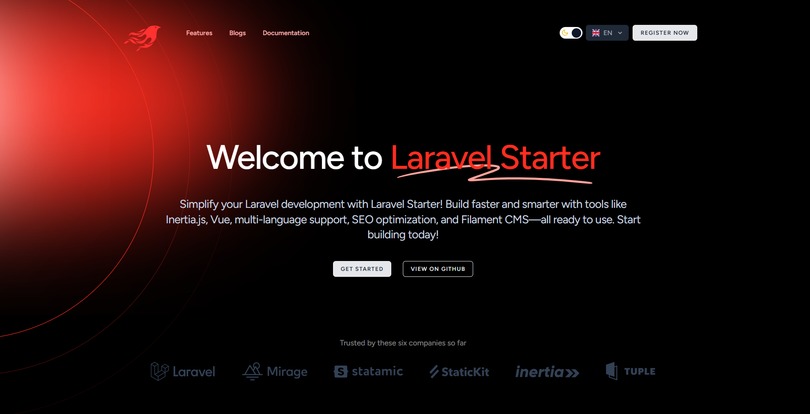

<p align="center"></p>

# Laravel Inerta Vue Starter

*If you are a Laravel developer and your priority is simplicity and faster development, you are in the right place. This starter project includes everything you need, including Inertia.js with Vue for the frontend, multi-language support, SSR, SEO-friendly features, and Filament as a CMS with all the tools you need to manage your website settings, activity log, translations, and more. Additionally, it includes all the recommended packages that can be useful for any project.*

This is a Laravel starter project that includes a comprehensive setup with Docker, Laravel Sail, and various packages to get you started quickly on any project. It includes:

- Laravel Sail with Docker support
- Mailpit for email testing
- MySQL for database
- PhpMyAdmin for database management
- Redis for caching
- Spatie packages for settings, SEO, media library, and permissions
- Filament PHP for admin panel

## Features

- **Laravel Sail**: A light-weight command-line interface for interacting with Laravel's default Docker development environment. It provides a simple way to set up and manage a local development environment using Docker.
  - **Mailpit**: Local email testing.
  - **MySQL**: Database management.
  - **PhpMyAdmin**: Web interface for MySQL.
  - **Redis**: Advanced key-value store.
- **Spatie Packages**:
  - **Media Library**: Associate files with Eloquent models.
  - **Settings**: Manage application settings.
  - **Laravel Translatable**: Make Eloquent models translatable.
  - **Laravel Sluggable**: Generate slugs for Eloquent models.
  - **Permission**: Manage user permissions and roles.
  - **Activity Log**: Log activity in your application.
  - **Laravel Backup**: Backup your application.
  - **Image**: Manipulate images.
  - **Laravel Tags**: Add tags to Eloquent models.
  - **Laravel Searchable**: Make Eloquent models searchable.
  - **Enum**: Provides support for creating and using enums in PHP.
- **Laravel Debugbar**: Integrates PHP Debug Bar with Laravel.
- **Laravel Telescope**: An elegant debug assistant for Laravel applications.
- **Laravel IDE Helper**: Generates a PHPDoc block for Laravel facades.
- **Laravel Socialite**: Provides an expressive, fluent interface to OAuth authentication.
- **Laravel Tinker**: Powerful REPL for the Laravel framework.
- **Laravel Seo**: A package to handle the SEO in any Laravel application, big or small.

- **Filament PHP**: A beautiful, modern, and customizable admin panel for Laravel applications.
  - **User Management**: Manage users and roles.
  - **Settings**: Manage application settings.
  - **Activity Log**: View activity logs.
  - **Media Library**: Manage media files.
  - **Permissions**: Manage user permissions.
  - **SEO**: Manage SEO settings.
  - **Tags**: Manage tags.
  - **Translations**: Manage translations.
  - **Backup**: Backup the application.

## Installation

### Prerequisites

- Docker (if you want to use Laravel Sail)
- PHP 8.2 or Higher
- Composer
- Node.js and npm

### Steps

1. **Clone the repository**:
    ```sh
    git clone https://github.com/abdessamadbettal/laravel-starter.git
    cd laravel-starter
    ```

2. **Copy the example environment file and configure it**:
    ```sh
    cp .env.example .env
    ```

3. **Install PHP dependencies**:
    ```sh
    composer install
    ```

4. **Install Node.js dependencies**:
    ```sh
    npm install
    ```

5. **Generate application key**:
    ```sh
    php artisan key:generate
    ```

6. **Start Docker containers**:
    ```sh
    sail up -d
    ```

7. **Run database migrations**:
    ```sh
    php artisan migrate:fresh --seed
    ```

8. **To compiles your Laravel translation files into a Vue i18n compatible JSON file**:
    ```sh
    php artisan vue:translations
    ```

9. **Test the application**:
    ```sh
        php artisan test 'or' sail test
    ```
10. **Make enums**:
    ```sh
     php artisan make:spatie-enum StatusEnum
    ```
11. **Make sure to dump the autoload**:
    ```sh
     composer dump-autoload
    ```

10. **Make services**:
    ```sh
     php artisan make:service UserService
    ```
11. **Make request**:
    ```sh
     php artisan make:request User/UpdateUserRequest
     php artisan make:request User/StoreUserRequest
    ```


## Usage

- **Access the application**: [http://localhost](http://localhost)
- **PhpMyAdmin**: [http://localhost:8080](http://localhost:8080)
- **Mailpit**: [http://localhost:8025](http://localhost:8025)

### Filament Admin Panel

- **Access the admin panel**: [http://localhost/admin](http://localhost/admin)
- **Default Admin User Credentials**:
  - **Email**: `admin@example.com`
  - **Password**: `password`

## Contributing

Feel free to submit issues or pull requests.

## License

This project is open-sourced software licensed under the [MIT license](LICENSE).
